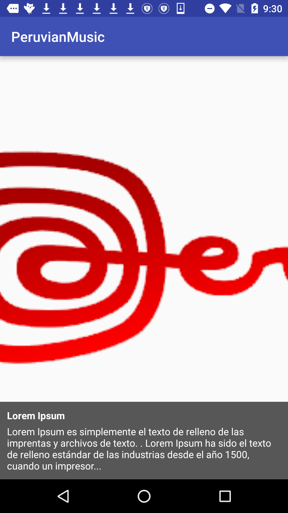
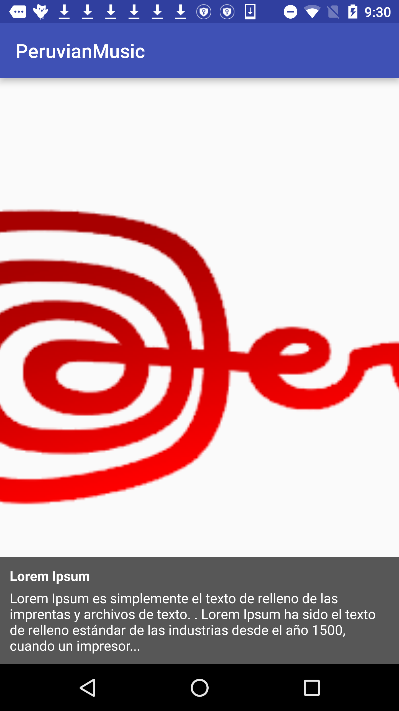

# Android-Multiple-Product-Flavors
Android Multiple Product Flavors

# Gradle Ext Properties
Definimos las versiones de las dependencias de nuestra App , para esto vamos al build.gradle del Proyecto.

```
  ext{
      //sdk and tools
      minSdkVersion = 14
      targetSdkVersion = 23
      compileSdkVersion = 23
      buildToolsVersion = '23.0.3'

      //dependencies versions
      supportLibraryVersion = '23.4.0'
      junit  = '4.12'

      //external libraries
      //RETROFIT 2
      retrofit2= '2.1.0'
      //GSON
      gson = '2.1.0'
      //INTERCEPTOR
      interceptor= '3.3.1'
      //GLIDE
      glide='3.7.0'
  }
```
Para aplicar las variables en la app y nuestros módulos, realizamos lo siguiente :

En el build.gradle de la app y del módulo
```
android {
    compileSdkVersion rootProject.compileSdkVersion
    buildToolsVersion rootProject.buildToolsVersion

    defaultConfig {
        applicationId "com.emedinaa.peruvianmusic"
        minSdkVersion rootProject.minSdkVersion
        targetSdkVersion rootProject.targetSdkVersion
        versionCode 1
        versionName "1.0"
    }
```
```
dependencies {
    compile fileTree(include: ['*.jar'], dir: 'libs')
    testCompile "junit:junit:$rootProject.junit"

    compile "com.android.support:appcompat-v7:$rootProject.supportLibraryVersion"
    compile "com.android.support:support-v4:$rootProject.supportLibraryVersion"
    compile "com.android.support:design:$rootProject.supportLibraryVersion"
    compile "com.android.support:cardview-v7:$rootProject.supportLibraryVersion"
    compile "com.android.support:recyclerview-v7:$rootProject.supportLibraryVersion"
    compile "com.github.bumptech.glide:glide:$rootProject.glide"
```
Con esto podemos tener centralizado las dependencias del proyecto

# Flavors 

Definimos los productFlavors de nuesta App ( build.gradle)
```
   productFlavors {
        devel {
            applicationId "com.emedinaa.peruvianmusic"
        }

        prod {
            applicationId "com.emedinaa.peruvianmusic"
        }
    }
```
Definimos las configuraciones para asociar los flavors de la App con los flavors de nuestros módulos
```
configurations {
    develDebugCompile
    prodDebugCompile
    prodReleaseCompile
}
```
En nuestro módulo "module-data" , definimos nuestros flavors
```
    productFlavors{
        def Properties serverProps = new Properties()
        serverProps.load(new FileInputStream(file('../server.properties')))

        dev {
            buildConfigField "String", "BASE_URL", serverProps["serverURL"]
        }

        prod {
            buildConfigField "String", "BASE_URL", serverProps["serverURL"]
        }
    }
```
Mediante un file "server.properties" , que se encuentra en la raiz del proyecto, guardamos variables que sean requeridas, como por ejemplo, el path de los servicios Restful.
```
serverURL="http://www.mocky.io"
```

Luego, para asociar los flavors de la App con los flavors de nuestros módulos, realizamos lo siguiente :
En el build.gradle de la App
```
    //compile project(":module-data")
    develDebugCompile project(path: ':module-data', configuration:'devDebug')
    prodDebugCompile project(path: ':module-data', configuration:'prodDebug')
    prodReleaseCompile project(path: ':module-data', configuration:'prodDebug')

```

Finalmente, las dependencias del build.gradle de la app quedaria asi :
```
dependencies {
    compile fileTree(include: ['*.jar'], dir: 'libs')
    testCompile "junit:junit:$rootProject.junit"

    compile "com.android.support:appcompat-v7:$rootProject.supportLibraryVersion"
    compile "com.android.support:support-v4:$rootProject.supportLibraryVersion"
    compile "com.android.support:design:$rootProject.supportLibraryVersion"
    compile "com.android.support:cardview-v7:$rootProject.supportLibraryVersion"
    compile "com.android.support:recyclerview-v7:$rootProject.supportLibraryVersion"
    compile "com.github.bumptech.glide:glide:$rootProject.glide"

    //compile project(":module-data")
    develDebugCompile project(path: ':module-data', configuration:'devDebug')
    prodDebugCompile project(path: ':module-data', configuration:'prodDebug')
    prodReleaseCompile project(path: ':module-data', configuration:'prodDebug')
}

```

# Build Variants


# Publicación


# Ejemplo : PeruvianMusic App

Entorno Dev

 

Entorno Release

 


# Dependencias 

- Retrofit 2 [http://square.github.io/retrofit/](http://square.github.io/retrofit/)

- Gson [https://github.com/google/gson](https://github.com/google/gson)

- Glide [https://github.com/bumptech/glide](https://github.com/bumptech/glide)
